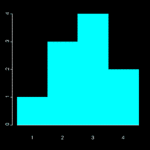
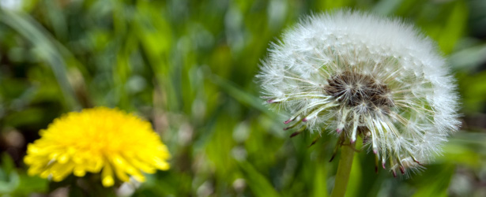

### Class #3

#### Bioinformática Prática 2018

Francisco Pina Martins

[@FPinaMartins](https://twitter.com/FPinaMartins)

---

## Statistical Concepts Revisited

---

## Variables

* Continuous <!-- .element: class="fragment" data-fragment-index="1" -->
  * Can assume an infinite number of values (eg. length) <!-- .element: class="fragment" data-fragment-index="2" -->

 <!-- .element: class="fragment" data-fragment-index="2" -->

---

## Variables

* Discrete <!-- .element: class="fragment" data-fragment-index="1" -->
 * Can assume a finite number of values (eg. number of beans) <!-- .element: class="fragment" data-fragment-index="2" -->

 <!-- .element: class="fragment" data-fragment-index="2" -->

---

## Measurement types

* Nominal (categorical)<!-- .element: class="fragment" data-fragment-index="1" -->
    * Discrete, unordered categories (eg. names)<!-- .element: class="fragment" data-fragment-index="1" -->
* Ordinal (ranked) <!-- .element: class="fragment" data-fragment-index="2" -->
    * Discrete, ordered categories, of unknown exact values (eg. cancer stages)<!-- .element: class="fragment" data-fragment-index="2" -->
* Circular <!-- .element: class="fragment" data-fragment-index="3" -->
    * The lowest and highest value are next to each other (eg. days of the year) <!-- .element: class="fragment" data-fragment-index="3" -->
* Ratios <!-- .element: class="fragment" data-fragment-index="4" -->
    * Ratios of two measurement variables (eg. head size/body size) <!-- .element: class="fragment" data-fragment-index="4" -->

---

## Dependent & independent variables

<ul>
<li class="fragment">Independent variables</li>
<ul>
<li class="fragment">May cause change in dependent variables</li>
</ul>
<li class="fragment">Dependent variables</li>
<ul>
<li class="fragment">Is affected by changes in another variable</li>
</ul>
</ul>

|||

## Which is which?

* Nitrogen content of soil and density of dandelions <!-- .element: class="fragment" data-fragment-index="1" -->
  * Nitrogen content might affect where dandelion plants live <!-- .element: class="fragment" data-fragment-index="2" -->
  * What if dandelions use a lot of nitrogen from the soil? <!-- .element: class="fragment" data-fragment-index="3" -->
* How could we test this? <!-- .element: class="fragment" data-fragment-index="4" -->

---

## [Would you like to know more?](http://www.biostathandbook.com/variabletypes.html)

---

## Accuracy & Precision

1. Random error <!-- .element: class="fragment" data-fragment-index="1" -->
2. Systematic error <!-- .element: class="fragment" data-fragment-index="2" -->
3. Perfect world <!-- .element: class="fragment" data-fragment-index="3" -->

---

## Populations & Samples

* Population
  * All possible observations

|||

## Populations & Samples

* Sample
  * Set of observations

[Alguns pokemons](link)

|||

## Populations & Samples

* Parameter

|||

## Populations & Samples

* Sample size

|||

* Sampling

---

## Descriptive statistics

* Central tendency
* Dispersal

---

## Central tendency

* Mean - Average of all values
  * Arithmetic
  * Geometric
  * Harmonic
  * Weighted or unweighted
* Median - Central occurrence
* Mode - Most frequent occurrence

|||

## Central tendency

---

## Dispersal

* Range - Diff. between Max. and Min.
* Variance - [Expectation of the squared deviation of a random variable from its mean](https://www.mathsisfun.com/data/standard-deviation-formulas.html)
* Standard deviation - [Square root of variance](https://www.mathsisfun.com/data/standard-deviation-formulas.html)
* Coefficient of variation - Ratio of Std. Dev. to the mean
* Standard error - Std. Dev. of the sampling distribution
* Confidence interval

|||

## Dispersal

|||

## Dispersal

---

## Reporting descriptive statistics

* Use a central tendency measurement coupled with a dispersal measurement
  * Mean + Std. Dev.
  * Median + range
* Obtain precision estimates using SE or confidence interval
* Always remember:
  * Which measurements you have used
  * Present the value of "N"
  * Indicate the units!!!!111!one!

---

## Other descriptors

* q-Quantiles -  values that partition a finite set of values into *q* subsets of (nearly) equal sizes
* Quartile - A type of quantile. Divides the data in 4 equal parts. (Q2 is the median)
* Percentiles - Values that divide the sample into 100 equal parts

---

## Skewness & Kurtosis

---

## Distribution examples

* Normal
* Exponential
* Poisson
* Lognormal
* Beta
* Gamma
* "Paranormal distribution - disguised as a pumpkin

---

## Data transformations

* Logaritmic
* Square root
* Exponetial
* Arcsen

---

## That's it for today!
